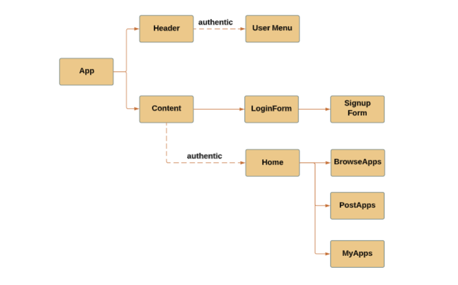
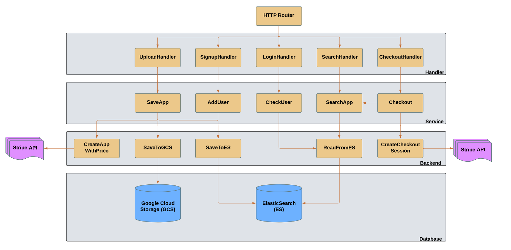

#  Lightweight Web Application Search and Purchase Platform

### *Introduction*

---

### *Developer Environment*

* Frontend

* Backend

---

### *Frontend Software Architecture*

---

### *Backend Software Architecture*

---
### *Backend Software Components*

---
### *Database*

---
 
### *Deployment*

* Frontend
  * Amazon Web Service (AWS) based
  * deploy frontend build package to AWS Simplify (PaaS)  

* Backend
  * Google Cloud Platform (GCP) based
  * Docker containerization technology
  * Create Dockerfile to include deployment configuration
  * Deploy the backend code package to Google App Engine [GAE] (PaaS)
